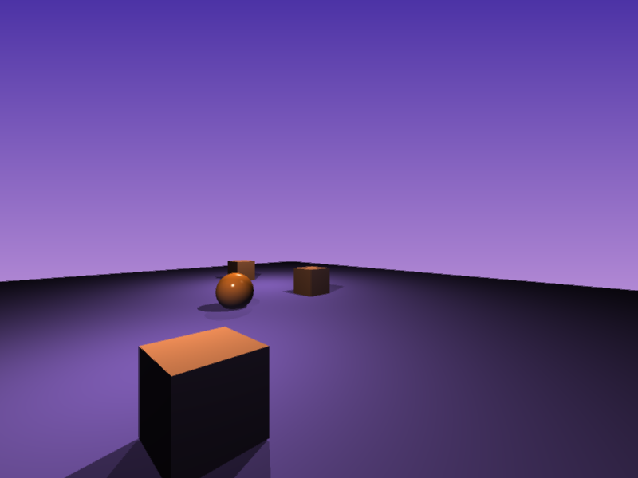

# RayTracer

Is a small custom ray tracer for fun that runs either on the CPU or GPU. 
The GPU implementation is written in CUDA. 

## File formats

Scene information is provided [.bascii](https://github.com/CharlesCarley/bAscii) files. 
The [Viewer](https://github.com/CharlesCarley/RayTracer/tree/master/Samples/Viewer) in the Samples directory is the main entry point.
It provides the means to load a file, specify a backend and display a scene. 

### Invoking

```
Viewer.exe Test01.bascii -r 1
```

```
Usage: Viewer.exe <options>

  <options>:

    -h, --help    Display this help message.
    -r, --backend Specify the backend renderer.
                   - Where the value is one of the following values:
                     - CPU Backend: 0
                     - GPU Backend: 1

    -o, --output  Specify an output file.
                   - Where the value is a file-system pathname.

```

As an example, the following image was rendered using the bAscii file.
```
Global:  { scene = "Scene"; }

SceneLibrary: {
    Scene: "Scene" {
        objects  = "ICam", 
                    "C.1", 
                    "C.2", 
                    "C.3", 
                    "C.4", 
                    "S.1", 
                    "L.1",
                    "L.2",
                    "L.3";
        zenith   = 0.95, 0.75, 0.95;
        horizon  = 0.3, 0.2, 0.65;
        flags    = 1;
    }
}

ShapeLibrary: {
    Cube:   "Cube.1"   { extent = 0.5; material = "Grey"; }
    Cube:   "Cube.2"   { extent = 1.5; material = "Mat"; }
    Sphere: "Sphere.1" { radius = 0.5; material = "Red"; }
}

ObjectLibrary: {
    Object: "C.1" { data = "Cube.1";   location =  0,  0, -1; scale = 80, 80, 1; }
    Object: "C.2" { data = "Cube.2";   location =  0,  5,  0; scale =  1,  1, 1; }
    Object: "C.3" { data = "Cube.2";   location =  8, -5,  0; scale =  1,  1, 1; }
    Object: "C.4" { data = "Cube.2";   location = -8,  5,  0; scale =  1,  1, 1; }
    Object: "S.1" { data = "Sphere.1"; location =  0,  0,  0; scale =  1,  5, 1; }
    Object: "L.1" { data = "Point.1";  location =  0,  0, 10; }
    Object: "L.2" { data = "Point.1";  location =  0, -5,  5; }
    Object: "L.3" { data = "Point.1";  location =  5,  5,  5; }

    Object: "ICam" {
        data     = "Camera";
        location = 4, -14, 3;
        rotation = 0, 0,  0.7853;
    }
}

CameraLibrary: {
    Camera: "Camera" {
        interactive = 1;
        clip        = 0.1, 1000.5;
    }
}

LightLibrary: {
    Light: "Point.1" {
        color     = 1,1,1;
        type      = 0;
        elevation = .1;
        decay     = .57214;
        power     = 60;
    }
}

MaterialLibrary: {
    Material: "Grey" {
        flags     = 1;
        color     = 0.5,.5,0.5; 
        ambient   = 1;
        diffuse   = 0.125;
        specular  = .01;
        hardness  = 2;
    }
    Material: "Mat" {
        flags     = 1;
        color     = 0.9,0.87,0.1456; 
        ambient   = 1;
        diffuse   = 0.125;
        specular  = 1;
        hardness  = 764;
    }
    Material: "Red" {
        flags     = 2;
        color     = 0.9, 0.7, 0.1;
        ambient   = 0.8;
        diffuse   = .5;
        specular  = 1;
        hardness  = 128;
    }
}
```

```
Viewer.exe Test01.bascii -r 0 -o test.png
```





### Goals 

The primary goal is to strike a balance between quality and performance in real-time.

## Building

This project uses CMake to generate Makefile or Project files. 
The primary CMake generators are `Unix Makefiles` and `Visual Studio 16 2019`

```sh
mkdir build
cd build
cmake ..
make
```

Optional defines.

| Option                  | Description                         | Default |
|:------------------------|:------------------------------------|:-------:|
| RayTracer_BUILD_TEST    | Build the unit test program.        |   OFF   |
| RayTracer_AUTO_RUN_TEST | Automatically run the test program. |   OFF   |

